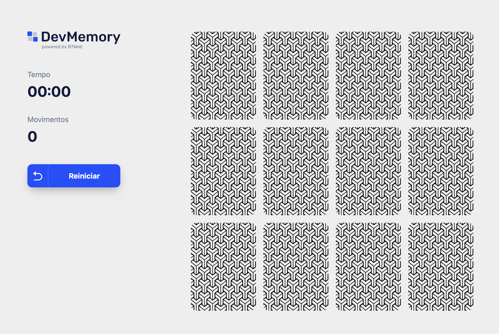

<h1 align='center'>
  
  
Jogo da memória

</h1>

  Jogo da memória baseado na aplicação do curso de React com TypeScript, do B7Web.

<h3 align='center'>
  <a href="https://memory-game-6zw55hpy8-welisonw.vercel.app/">Jogue agora!</a>
</h3>
 

  

<h2>🛠️ Tecnologias</h2>
<ul>
  <li><a href="https://www.typescriptlang.org/">TypeScript</a></li>
  <li><a href="https://react.dev/">React</a></li>
  <li><a href="https://vitejs.dev/">Vite</a></li>
  <li><a href="https://styled-components.com/">Styled-components</a></li>
</ul>

<h2>💻 Rodando o projeto localmente</h2>

<pre>
  <code>
    # Clone este repositório
    $ git clone https://github.com/welisonw/memory-game.git
    
    # Entre na pasta do projeto
    $ cd memory-game
    
    # Instale as dependências
    $ npm install  ou  yarn install
    
    # Inicie o projeto
    $ npm run dev  ou  yarn run dev
    
    # O app vai inicializar em http://localhost:5173/
  </code>
</pre>
